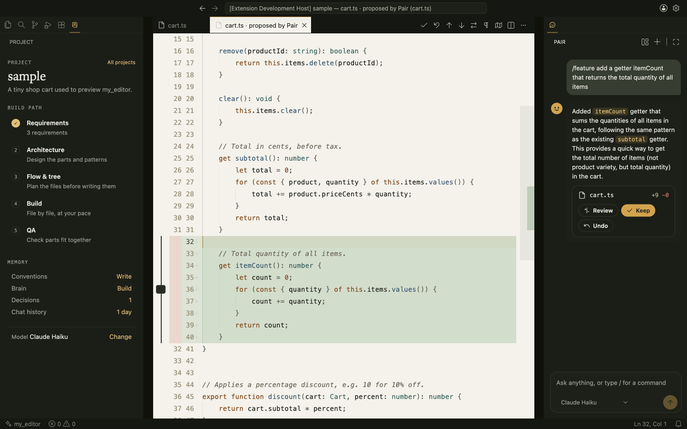
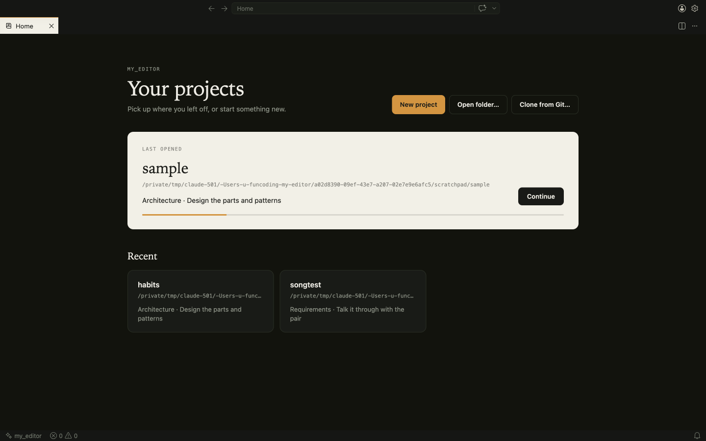

# my_editor

A code editor where **you** stay in control. Built on VSCodium (the open-source VS Code), it adds a pair
programmer that writes only what you ask, a project brain that keeps a short map of your codebase, and a
calm, writing-first interface.

**Vision:** help humans make better programs with AI. **Mission:** give developers a project-aware pair
programmer that consults them before coding, helps them spot and understand problems while they code, and
offers changes they can review. The product aims for sound design, useful comments, focused files, and a
400-line maximum for source files. The current source adds review choices, AI proposal checks, and a
VSCodium save gate for human edits. These are built into the installed app but still need live checks;
see [vision, mission, and status](docs/vision-and-status.md).

All documentation is listed in [`docs/README.md`](docs/README.md). Start with:

- [`docs/vision-and-status.md`](docs/vision-and-status.md): aim, objectives, and current status
- [`docs/plans/my_editor-plan-v2.md`](docs/plans/my_editor-plan-v2.md): the plan and requirements
- [`docs/development.md`](docs/development.md): how the build works, tests, and releasing
- [`docs/patches.md`](docs/patches.md): the core VS Code patches and why each exists
- [`CHANGELOG.md`](CHANGELOG.md), [`docs/decisions/`](docs/decisions/), [`docs/screens/`](docs/screens/)





## What works today

- **Home:** opening the app without a project shows your projects with their progress, plus New project,
  Open folder and Clone from Git. Clone accepts a repository URL plus an optional branch, or a GitHub branch
  page URL; it checks out that branch when cloning. A new project gets git, a starter `.my_editor/`, and
  `/requirements` in chat.

- **The editor:** VSCodium 1.135 rebranded as my_editor (own name, icon, bundle id, data folder).
- **The look:** *Paper* theme (dark olive chrome, cream page) and *Night*; the code sits on a centred page;
  the minimap, breadcrumbs, most of the status bar and the Copilot prompts are gone.
- **The Project view** (left sidebar): the build path (Requirements → Architecture → Flow & tree → Build → QA)
  with live status, memory (conventions, brain, decisions, chat history) and the active model.
- **The Pair** (centered editor tab, with an optional right sidebar): my_editor's own chat. Shan the
  panda, Soki the owl, Ada the moth, Lisko the lynx, Diji the hedgehog, Poppy the penguin, and Hopper
  the frog switch with project stage and task. You can pin one or return to Auto. All share the same model,
  project context, and review rules. See [characters and change finder](docs/characters-and-change-finder.md).
  Open the skill menu for Plan:
  Requirements, Architecture, Plan the files, Brainstorm; Build: Find a change, Next step, Add a feature, Change selection,
  Explain, Why; Fix: Review, Debug, Tests, Refactor; plus your own skills). Type `/` for commands.
  Code changes come back as proposals: review them in an inline diff, undo single parts with the gutter
  arrow, then **Keep** (writes and saves) or **Undo**. Nothing touches your file before Keep.
- **Project-aware chat:** ordinary Pair requests can search and read more project files as needed, inspect
  Git history, and propose changes to several files in one conversation. Test commands run only after you
  approve them in the editor. Tests use the current workspace, so keep a proposal before testing that change.
  Unkept proposals expire when the app restarts.
  The Pair refreshes brain, source, planning and Git context each turn, and condenses older conversation into
  a working brief while preserving the recent messages.
- **Find where to change something:** describe it or use `/locate`. Pair searches the project, opens the
  relevant files as tabs near verified lines, and explains their roles before suggesting an edit.
- **Comment guidance:** newly added functions or classes without a useful comment receive an advisory note.
  Its Quick Fix lets you ask Pair for a reviewed suggestion or get steps to write the comment yourself.
  Toggle guidance with the speech-bubble button in the editor toolbar.
- **Live quality guidance:** Navigator and structure findings offer the same reviewed-fix or manual-guidance
  choice. Source files get a warning near 400 lines; AI proposals and Keep reject source files above 400 lines
  or with multiple top-level classes. A VSCodium core patch blocks human saves above 400 lines after formatters;
  its live app behavior remains to be checked.
- **This file** (under the file tree): symbols, Pair notes and git history for the open file, in my_editor's style.
- **A quiet window:** the left bar has only Files and Project; Search, Git, Run and Extensions still work
  from their shortcuts and appear only while open.
- **Languages built in:** JavaScript/TypeScript, Python (basedpyright, debugpy), Rust (rust-analyzer),
  Go and C/C++ (clangd). Pinned in `overlay/bundled-extensions.json`, checksum-verified at build time.
- **Models** — pick with **my_editor: Choose Default Model** (or *Change* in the Project view):
  - **Claude subscription** through your Claude Code login (`claude` CLI): Opus, Sonnet, Haiku. The CLI runs
    without its own tools, MCP or saved session; Pair's host tools are available in chat. API-key variables are
    removed so billing never switches silently.
  - **ChatGPT subscription** through your Codex login (`codex exec`, read-only sandbox, empty working folder).
    Pair's project tools run in the editor host.
  - **Local:** Ollama and LM Studio, listed whenever their servers are running.
  - **API keys** (kept in the macOS keychain): Anthropic, OpenAI, OpenRouter, any OpenAI-compatible URL.
- **Visual project maps:** in Project, open **Architecture map** to see parts and their code links, or **File tree** to browse and search planned files. Both read the saved `.my_editor/specs/` documents.
- **Navigator:** after each save it reviews only the changed lines and shows at most three notes, including
  worthwhile correctness, performance, style, design, and comment issues. It never edits.
- **Project brain:** open a project that already has code and the pair asks first: *Shall I get to know this
  project?* If you say yes, it reads every file and writes `.my_editor/brain/`: a map of each file's imports,
  exports and a one-line summary, and a note per part. It also drafts `specs/architecture.md` and `specs/tree.json`
  for you to Keep or Undo. Your code is never changed. Long files are read in pieces. Running it again only
  redoes files that changed. Anything it could not cover (huge or generated files, very big projects) is listed,
  never skipped silently. The brain stays current on save, and the pair uses it as
  context. To run it again, use **Analyse** in the Project view or **my_editor: Analyse This Project**.

## Build and run (macOS)

Needs Node 24, Xcode command-line tools, `jq`, Python 3, and about 20 GB of free disk.

```bash
scripts/build.sh            # first build: fetches VSCodium + VS Code, ~15 min
scripts/build.sh --reuse    # later builds reuse the downloaded source, ~10 min
scripts/run.sh ~/some/project
scripts/install.sh          # quick: compile built-in extensions, then install
scripts/install.sh --full   # rebuild the whole editor and apply core patches, then install
```

Both install options copy the app to `/Applications/my_editor.app`.
Run `scripts/install.sh` by itself for fast Pair, Project, and theme updates in the existing app bundle.
Use `scripts/install.sh --full` for editor core patches, such as the save-time 400-line gate, or when no
app has been built yet. The full option compiles VSCodium and takes much longer. Both options stop if
their build step fails. The installer signs and checks the finished app bundle before copying it.

The finished app is `app/my_editor.app`. It is self-contained and runs from anywhere. `vscodium/` (about 7 GB)
is only the build workspace; delete it to free space, and the next build downloads it again.

## How the repo is laid out

```
overlay/                 everything my_editor adds on top of VSCodium
  product.json           name, ids and the calm default settings
  patches/NNN-*.patch    the few core changes (listed in docs/patches.md)
  bundled-extensions.json  pinned language extensions, sha256-checked at build time
  extensions/
    my-editor-core/      pair, models, brain, navigator, home, project view, skills
    my-editor-look/      the Paper and Night themes and file icons
  src/                   resource overrides (app icon, empty-editor mark, workbench CSS)
scripts/
  build.sh               full build (--reuse to skip the source download)
  install.sh             quick or --full install to /Applications
  run.sh                 open the built app
  fetch-vscodium.sh      check out the pinned VSCodium commit
  fetch-extensions.py    download and verify the bundled language extensions
  gen-themes.py, gen-icons.py  regenerate the themes and file icons
upstream.json            the pinned VSCodium commit (VS Code 1.135.0)
design/                  app icon sources
docs/                    vision, status, plans, decisions, guides, screenshots
roadmap.md               comparison with other editors and the roadmap
vscodium/                the pinned checkout and build workspace (git-ignored, safe to delete)
app/                     the finished my_editor.app (git-ignored)
logs/                    build logs (git-ignored)
```

VSCodium itself is never edited: `scripts/build.sh` copies the overlay into a pinned checkout and builds it.
To move to a newer VS Code, change the commit in `upstream.json`, rebuild, and fix any patch that no longer applies.

## Working on the core extension

```bash
cd overlay/extensions/my-editor-core
npm install
npm run compile   # type-check and bundle to dist/
npm test          # unit tests (node --test)
```

To try a change without rebuilding the app, launch the built app with
`--extensionDevelopmentPath=<path to the extension> --enable-proposed-api=my-editor.my-editor-core`.
More detail, including the source map and the release steps, is in [`docs/development.md`](docs/development.md).
