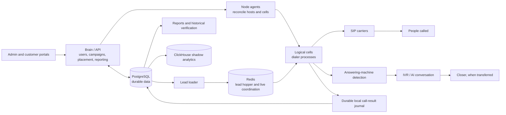
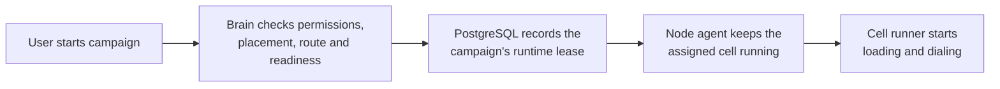
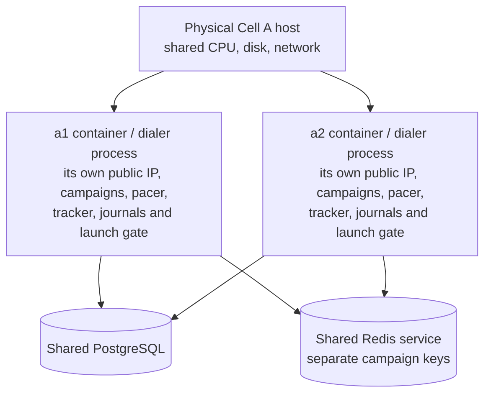
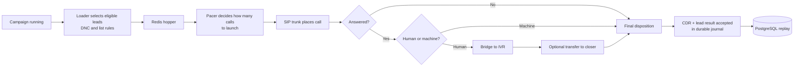
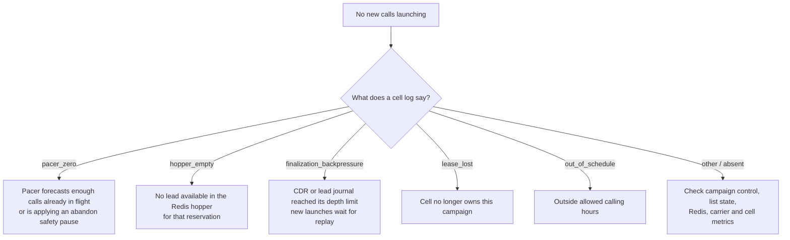
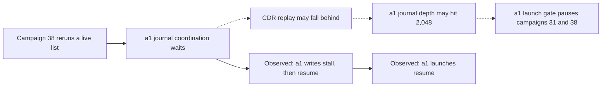
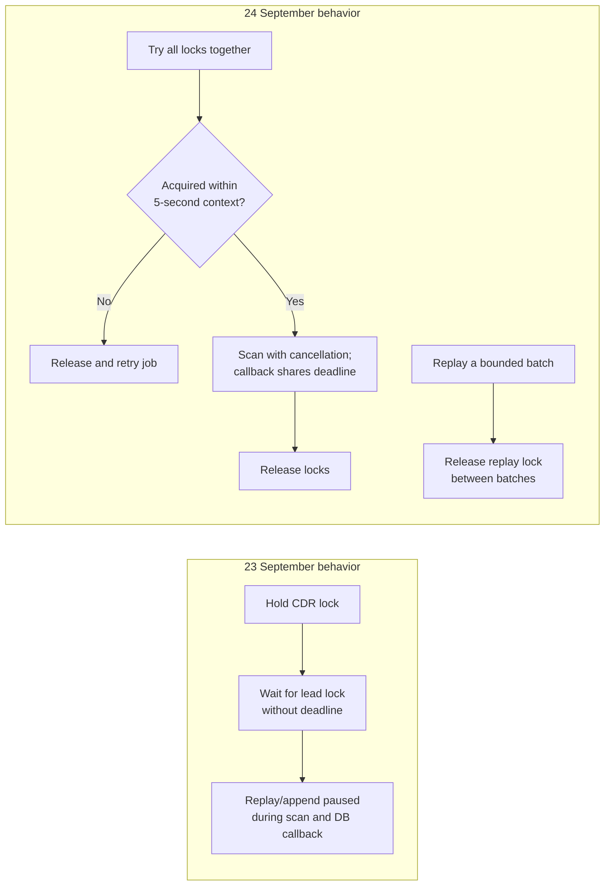

# m_dialer: a plain-English project guide

*Checked 24 September 2026.* This guide explains the system and the a1 incident. The local project brain was built from commit `69f5b1a`; the newer production source checked for this guide is `5cfa087`. Campaign placement and live status can change, so examples below are dated.

**Read the labels carefully:** **Observed** means supported by saved logs or database exports. **Code behavior** means the source has that path. **Likely** is an explanation that fits both but lacks the old process log needed to prove the exact step.

## 1. The whole system in one picture

The product chooses leads, places outbound calls, detects who answered, connects people to an IVR or closer, and records the result. PostgreSQL is the durable source of truth. Redis helps with fast, temporary work. The Brain coordinates the fleet; cells actually dial.



The IVR handles the conversation; the dialer gets a human there and maintains the call. ClickHouse is a shadow analytics path, not the authoritative record for campaign and lead state.

### The seven parts, in ordinary language

| Part | Job |
| --- | --- |
| Portals | Let staff and customers manage campaigns and see results, subject to tenant and role permissions. |
| Brain / API | Validate changes, decide placement, keep fleet state, and serve reporting. |
| PostgreSQL | Keep the durable facts: tenants, campaigns, leads, leases, call records, DNC, and reporting state. |
| Redis | Hold fast, rebuildable work such as the lead hopper and coordination caches. |
| Node agents | Make each host's running cells match the approved desired state and report health. |
| Logical cells | Run campaign pacers, place SIP calls, track calls, and accept results into local journals. |
| Carrier, IVR, and closer | Carrier reaches the person; IVR talks to them; a closer can receive a transfer. |

**Small glossary:** A *tenant* is a customer/security boundary. A *campaign* is a dialing job. A *lead* is one contact to attempt; a *list* groups leads. A *hopper* is Redis's ready-to-dial queue. A *bot slot* is IVR conversation capacity; a ringing call is still in the pipeline. A *CDR* is the call record. A *journal* is a local durable queue that can replay records into PostgreSQL after a delay or failure.



## 2. What a1 and a2 are

`a1` and `a2` are **logical cells**, not two names for one queue. The placement contract defines a logical cell as one dialer process with one public IP. Both can run on the same physical Cell A host. A campaign runs on exactly one logical cell at a time.



| Shared | Separate for each logical cell |
| --- | --- |
| Physical host, PostgreSQL service, Redis service, fleet control | Process memory, journal locks, journal depth, launch gate, runtime campaigns, public IP and container |

On **23 September**, campaign 31 (Mars2-FE) and campaign 38 (Rapid Squad) were on a1. Rapid Squad's live list reruns were owned by a1. a2 continued because its own dialer process and journals were not waiting on a1's locks. Shared database pressure could still affect both cells; the observed difference points toward an a1-local path.

## 3. One call from start to finish



The pacer can stop new launches while calls already in the pipeline continue. The cell's finalization gate can also stop **new** launches if its durable call-result backlog gets too deep.

## 4. When ringing stops: which gate fired?



The **24 September** a1 log excerpt showed `pacer_zero` and `hopper_empty`, not `finalization_backpressure`. Those lines describe current pacing and lead supply; they do not identify the gate during the **23 September** incident. `pacer_zero` by itself does not prove the ten-second abandon rule: a large pipeline can also make the forecast return zero.

## 5. The September 23 a1 pauses

**Observed:** four Rapid Squad `exclude_live` reruns began near four long a1 write stalls. Final CDR and lead-result writes from a1 appeared later in bursts; a2 continued. Mars2-FE and Rapid Squad launches on a1 stopped and restarted together. The configured backpressure limit was 2,048 journal records.

**Code behavior in the incident image:** the rerun took the CDR replay lock before waiting without a deadline for the lead replay lock. Replay could hold its lock through a whole journal rotation. Once the rerun acquired all locks, it scanned both local journals and called PostgreSQL while append and replay were paused. That work was shared by every campaign on a1.



**Likely, not directly recorded:** `finalization_backpressure` was the exact launch gate. The database reconstruction counts unwritten records; the gate reads an in-process journal counter. The old a1 container logs were lost after replacement, so that final step cannot be proven from the saved exports.

## 6. What the newer Git fixed

The corrective source commit `846dd54` is included in the image observed on a1 and a2 on 24 September (`5cfa087`, image digest beginning `b63fa37`). It changes the risky coordination pattern:



This is a targeted fix for long lock convoys, with tests for cancellation and another campaign continuing to finalize. **Remaining risk:** the successful protection step still briefly holds locks shared by a1 campaigns while it scans pending journal data and writes protection to PostgreSQL. Production evidence has not established that every possible pause is gone. Raising the 2,048 limit would not remove the underlying stall.

## 7. Why the 58-million-row work can take hours

There are **two different operations** people may call “indexing.” An older UI label about inventory updating also mixed reporting freshness with operational state; it did not establish that PostgreSQL was building an index.

1. **Building a PostgreSQL index** (`CREATE INDEX`, often `CONCURRENTLY`). This reads a large table; concurrent builds also validate it and wait for old transactions. It can take hours on a busy large table. PostgreSQL exposes a running build in `pg_stat_progress_create_index` ([progress documentation](https://www.postgresql.org/docs/current/progress-reporting.html), [index documentation](https://www.postgresql.org/docs/current/sql-createindex.html)).
2. **Historical reporting inventory verification.** Project notes describe an approximately 58-million-row fleet inventory ledger. The old verifier repeatedly timed out for nine large campaigns. The newer verifier stores checkpoints and processes bounded chunks, but it still has one historical execution lane and yields to live dialing. Its normal duty is at most 10% while campaigns dial, so total completion can take many hours even if individual indexed lookups are fast.

The 24 September release reduced repeated transaction overhead and made cleanup use campaign-indexed probes. Its migration 122 adds acceleration controls; it does **not** rebuild the 58-million-row ledger or start a full-table index build. The documentation does not give a guaranteed production completion time.

To tell which operation is running, use this **read-only** SQL in the production database:

```sql
SELECT p.pid, p.relid::regclass AS table_name,
       p.index_relid::regclass AS index_name,
       p.command, p.phase, p.blocks_done, p.blocks_total,
       a.wait_event_type, a.wait_event
FROM pg_stat_progress_create_index AS p
JOIN pg_stat_activity AS a USING (pid);
```

No rows means no index build is running **at that moment**; it does not mean historical verification is finished. Check `reporting_inventory_verification` and the background worker status for that separate progress.

## 8. Where to look in the code

| Question | Main place |
| --- | --- |
| Who may access a tenant or campaign? | `internal/api`, `internal/store` |
| Where does a campaign run? | `internal/cluster`, `internal/api`, `internal/nodeagent` |
| How are leads loaded and queued? | `internal/lead`, `internal/infra` |
| Why did calls launch or pause? | `internal/engine/runner.go`, `internal/engine/pacer.go` |
| Which SIP carrier was used? | `internal/carrier`, `internal/sipout` |
| Human or machine? | `internal/vad`, `internal/amd` |
| What happened after answer? | `internal/call`, `internal/sipout`, `internal/disposition` |
| Where are final results made durable? | `internal/finalize`, `internal/store` |
| Why are report counts stale? | `internal/store/reporting_inventory*`, `internal/api/reporting*` |
| What image/config reached a cell? | `cmd/node-agent`, `deploy/production`, deployment receipts |

## 9. A future my_editor feature: “Explain this project”

The editor should generate this kind of guide from the opened project, with a clickable overview graph, call/data flows, deployment map, glossary, and “why this file matters” links. A user could choose a campaign, cell, or incident and see the relevant path without reading hundreds of files.

It should show **three separate evidence layers**: (1) current source and Git commit, (2) project-brain summary and its build commit, and (3) live observations with timestamps. A stale brain must visibly say it is stale. The view should label confirmed behavior, likely explanations, and unknowns, and update affected diagrams when commits change the code. It should never present a generated explanation as a live measurement.

### Main sources used

- `.my_editor/brain/index.md` (built at `69f5b1a`), `docs/CAMPAIGN_PLACEMENT_AND_OFFBOARDING.md`, `docs/ARCHITECTURE.md`.
- Incident exports in `/Users/u/funcoding/Dialer /logs/predictdial-incident/` and the saved `m_dialer1` Claude Code session.
- Corrective commit `846dd54`, deployed source `5cfa087`, `docs/INVENTORY_ACCELERATION_20260924.md`, and `docs/WORKING_NOTES_BOUNDED_INVENTORY_20260922.md`.
