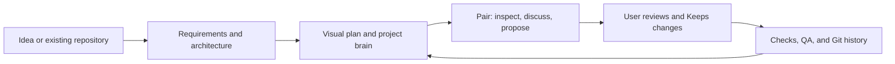

# my_editor: vision, mission, and current status

- **As of:** 25 September 2026
- **Current version:** 0.0.6 alpha source; installed-app verification pending
- **Stage:** Working macOS alpha; still being validated on real projects

## Vision

Help people make better software with AI. A developer should understand and direct the work, learn from the process, and remain responsible for the result. my_editor should support careful engineering, whether the person writes the code or asks AI to write a small or large part of it.

## Mission

Build a project-aware editor that works like a thoughtful pair programmer: consult the developer about the goal and approach, inspect current code and decisions, help plan the change, and offer specific guidance while the developer codes. When asked to write code, Pair proposes reviewable changes and explains how to check them. It helps the developer find and fix mistakes without taking control away.

## Aim and product promise

my_editor is a code editor for people who want to build and maintain software with an AI pair programmer while staying in control of the work. It should help a user understand the project, decide what to build, write and review code, check quality, and manage changes over time. Its interface should make those jobs clear and pleasant, especially in a large project where a chat model cannot hold every file in one prompt.

The central promise is **continuity with evidence**: Pair should remember the user's goal and accepted decisions, know which project is open, retrieve the relevant current files, and check Git before claiming what changed. The project brain is a guide to where evidence lives. Source files and Git remain the authority when a brain note is stale or incomplete.

### Working principles

- **Consult before coding.** Pair can write a function, file, or larger part of a project after discussing the intended behavior, scope, design, and checks with the developer. The person explicitly requests the change and reviews each proposed diff before it reaches the project.
- **Help while the person codes.** Watch for likely mistakes, performance problems, inconsistent style, duplicated logic, weak design, and missing or misleading comments. Explain a finding with its location and reason. Offer to propose a fix, or guide the person through fixing it themselves. Advice does not edit code.
- **Keep engineering standards high.** Follow the project's conventions and sound programming practices: clear responsibilities, appropriate design patterns, readable names and control flow, useful error handling, relevant tests, and comments that explain intent or non-obvious behavior. Do not force a pattern where a simpler design is clearer.
- **Keep source files focused and short.** A source file has one clear responsibility. Where classes are used, keep one class per file. No human or AI code change should leave a source file above **400 lines**. Warn as it approaches the limit; at the limit, guide a split into cohesive files. Pair must not propose or Keep a change that crosses it. Existing oversized files need a guided refactor rather than further growth.
- **Teach, do not take over.** The developer chooses whether to accept a suggestion, request a fix, or make the change by hand. Pair explains trade-offs and verification so the person can make an informed choice.

These are product requirements. The current source now offers fix-or-guide actions for Navigator, comment, and structure findings. It rejects AI proposals and Keep actions that exceed 400 lines or contain multiple top-level classes in one file. Human edits receive live diagnostics; a VSCodium core patch blocks saves above 400 lines after save participants run. Comment guidance is advisory and does not insert code automatically. The core patch and new flow still need a full build and live app validation.

## Who it serves

The first user is an individual developer working on new and existing projects. They may write code themselves, ask Pair to take a small step, or discuss an approach before editing. They need useful AI help without losing the ability to inspect, change, reject, or turn off that help.

## Product objectives

| Objective | What the user should be able to do |
|---|---|
| Pair programming | Ask for explanations, reviews, debugging help, ideas, or a requested code change. Pair reads the relevant project evidence and works with the user across several turns. |
| Live coding guidance | While writing code, get actionable findings about correctness, performance, style, design and comments; choose an AI-proposed fix or guided manual fix. |
| Code structure | Keep each source file focused, one class per file where relevant, and at most 400 lines after any human or AI change. |
| Human control | Review every AI code or document change as a diff. Keep or undo it; advice and background review never edit silently. |
| Requirements and design | Work from an idea through requirements, architecture, flows, and a planned file tree, then revisit those decisions when the project changes. |
| Project memory | Reopen a project or continue a long chat without losing its purpose, conventions, accepted decisions, current task, important files, and unresolved work. Retrieve fresh details instead of sending the whole repository to a model. |
| Change management | See what changed in Git, why a choice was made, which requirements and files may be affected, what is proposed, what was kept, and what still needs checking. |
| Quality assurance | Review changed code, run relevant checks with user approval, connect findings to architecture and requirements, and keep a readable record of results. |
| Large-project navigation | Use the brain, visual architecture map, file tree, source search, and dependency links to find the right area of a large repository. Show coverage gaps instead of implying the whole project was examined. |
| Clear interface | Provide a calm, readable coding space with useful layouts, visible model choice, discoverable actions, and minimal UI clutter. |
| Model choice | Let the user choose subscription, API, or local models while keeping the same project-aware Pair workflow. |

## How the experience should work

The brain lives with the project under `.my_editor/`. It contains a short index, module notes, and a file map. Requirements, architecture, decisions, and chat records add the reasons behind the code. Pair uses a short working brief for older conversation, keeps recent turns live, and refreshes project and Git context for each request. On a question that needs more evidence, it should search and read files during the conversation. A model's answer must distinguish observed source, recorded decisions, test results, and predictions.

For a change, the desired record is: **request → affected requirements and files → proposed diffs → user decision → checks → commit**. The user should be able to return later and answer both “why did this change?” and “what might changing it again affect?” Import and requirement links can suggest impact; they do not prove runtime behavior, so checks and review remain necessary.

## What is built now

The installed 0.0.5 alpha includes:

- A branded VSCodium editor for macOS arm64, with Paper and Night themes, a quieter workbench, a Home screen, and Project and Pair sidebars. Home can clone a repository at a chosen branch, including from a GitHub branch-page URL.
- Guided requirements, architecture, file planning, brainstorming, file work, review, and QA entry points. Planned architecture and file trees have visual views.
- Project analysis for existing repositories. It produces a brain index, file map, and module notes; it reports files it could not cover and can reanalyse changed files.
- Pair chat with project source excerpts, the open file, project plans, saved decisions, a compacted conversation brief, and refreshed Git context. In ordinary chat, Pair can request bounded file search and reads, inspect Git, and prepare several file proposals during one reply.
- Keep/Undo diff review for AI changes. Test commands for npm, Go, Cargo, and pytest require approval and run against the current workspace; unkept proposals are not included.
- Change history and an impact list based on Git, brain links, planned files, and language information. Navigator gives notes on changed lines without editing them. QA can produce a fit report for selected files or a folder.
- Claude and Codex subscription routes, local Ollama and LM Studio routes, and API-key routes. The model can be selected in the editor.
- Pair can retrieve long earlier chat messages, search saved records, inspect current project and brain revisions, and request approved project observations. Proposal and investigation records link evidence to a chat request.

The current unreleased extension source also adds a centered Pair chat with seven [original characters](characters-and-change-finder.md), task and project-stage switching, and a manual pin. A change-location request searches source and opens verified file lines for review before coding. The characters use the same model, context, permissions, and Keep/Undo review. The right sidebar remains available. Navigator, comment, and structure diagnostics can open Pair for a reviewed fix or manual guidance. Human edits receive 360-line warnings and 400-line errors, while AI proposals and Keep have a hard 400-line and one-class check. A VSCodium core patch adds a save-time 400-line check for human edits.

The detailed feature checklist is in [progress.md](progress.md). Release changes are in [CHANGELOG.md](../CHANGELOG.md); the original requirements and design decisions are in [my_editor-plan-v2.md](plans/my_editor-plan-v2.md).

## Where we are

This is a usable **alpha**, not a finished large-project workflow. The current 0.0.6 extension source compiles and its automated tests pass. The earlier 0.0.5 extension was installed in an existing app bundle. A full editor rebuild on 23 September was blocked when Electron headers could not be downloaded. The 0.0.6 chat and guidance changes have not been validated in a running app; this workspace's app bundle currently fails to launch.

Current limits matter to the product promise:

- Brain analysis has size and file-count limits. It reports uncovered files, but freshness and retrieval still need testing on much larger repositories.
- Pair's tool loop has a 60-check safety bound. It offers file search and reads, Git inspection, approved test commands and named observations, and reviewed file proposals; it does not have an unrestricted terminal. Large or complex changes may need several requests.
- Test runs inspect the current workspace. A proposal must be Kept before those tests verify its code. Unkept proposals expire on app restart.
- Change impact is a useful dependency hint. Proposal and investigation records exist, but a complete change record linking requirements, checks, decisions, and commits is still to be built.
- The interface and model routes need more live use across different projects, providers, and window layouts.
- Navigator reviews changed lines on save and can suggest evidenced performance, style, design, and comment issues as well as likely mistakes. Comment guidance is advisory. The Quick Fix choices, AI proposal gate, and core save patch are implemented in source but need app validation. Focused responsibility and design patterns also need judgment rather than a simple automatic rule.

## Next objectives

1. **Prove Pair on real projects.** In the installed app, test a question requiring several file reads, a multi-file change, review and Keep, then an approved test run. Try at least one local model and one subscription model. Confirm that Pair identifies the open project and cites current evidence instead of saying the workspace is empty.
2. **Strengthen continuity.** Test long conversations, restarts, stale brain entries, incomplete analysis, and model input limits. Keep the active goal and accepted decisions visible while retrieving fresh source only as needed.
3. **Complete change management.** Make a change record that links the user request, affected requirements and architecture, proposed and kept files, QA results, decisions, and Git commits. Make impact explanations inspectable and clearly separate predictions from verified results.
4. **Close the QA loop.** After a change is Kept, make it easy to run the right tests, view failures, request fixes, and save the outcome. Check requirement coverage and architecture fit without turning advisory findings into silent edits.
5. **Help during human coding.** Build and validate the new Quick Fix actions, AI proposal gate, and editor-level save gate in the running app. Add guided splits for oversized files. Continue improving the evidence and usefulness of correctness, performance, style, design, and comment findings.
6. **Polish the interface and release path.** Validate model and reasoning selection, panel resizing and file opening, navigation, and visual maps with real use. Make full builds and smoke tests repeatable before wider distribution.

## Success criteria

my_editor is meeting its aim when a user can return to a large project after time away, understand what is being built and why, ask Pair to investigate a current problem with cited source and Git evidence, review a requested change before any file is written, verify the kept change, and later trace its purpose and likely impact. While the user codes, it catches worthwhile issues, offers a choice between a reviewed fix and manual guidance, and keeps source files focused and within 400 lines. The same project must remain usable when AI assistance is off.
